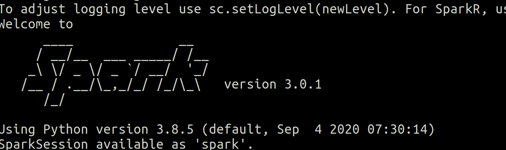

# spark-course
1. [Primeros pasos](#schema)
2. [Primera ejecución del contador](#schema2)

# 1. Primeros pasos
1º  Crear entorno con Conda para trabajar con pyspark:

          
 ~~~ python
conda create --name spark-course python=3.8
~~~
spark-course = nombre del entorno
python = 3.8, versióm de python para el entrono.

2ª Activar el entorno
~~~ python
conda activate spark-course
~~~

2º Instalar pyspark  y openjdk
~~~ python
conda install pyspark openjdk

~~~

3º Comprobamos que se ha instalado correctamente entrando el promt de spark
~~~ 
(spark-course) ➜  ~ pyspark
~~~ 

# 1. Primera ejecución del contador
~~~ python
(spark-course) ➜  ~ spark-submit ratings.counter.py
~~~