# spark-course
0. [Info en el shell](#schema0)
1. [Primeros pasos](#schema)
2. [Primera ejecución del contador](#schema2)
3. [Key/ Value RDD'S](#schema3)
4. [Filtering RDD'S](#schema4)
5. [map VS. flatmap](#schema5)
6. [Text normalization with Regex](#schema6)
7. [Total spent by customer](#schema7)
8. [Introducción a spark-SQL](#schema8)
9. [Usando las funciones de SQL](#schema9)
10. [SprakSession.read y withColumn()](#schema10)
11. [Broadcast variables](#schema11)
12. [Most popular superhero](#schema12)
13. [Introducing Breadth-First-Search](#schema13)
14. [Item-Based Collaborative Filtering in Spark, cache(), and persist()](#schema14)
15. [Introducing Spark.ML](#schema15)
20. [Enlaces ](#schema20)

# 0. INFO en el shell
~~~python
spark = SparkSession.builder.getOrCreate()
spark.sparkContext.setLogLevel("ERROR")

conf = SparkConf().setMaster("local").setAppName("RatingsHistogram")
sc = SparkContext(conf = conf)
sc.setLogLevel("ERROR") 
~~~

# 1. Primeros pasos
1º  Crear entorno con Conda para trabajar con pyspark:

          
 ~~~ python
conda create --name spark-course python=3.8
~~~
spark-course = nombre del entorno
python = 3.8, versióm de python para el entrono.

2ª Activar el entorno
~~~ python
conda activate spark-course
~~~

2º Instalar pyspark  y openjdk
~~~ python
conda install pyspark openjdk

~~~

3º Comprobamos que se ha instalado correctamente entrando el promt de spark
~~~ 
(spark-course) ➜  ~ pyspark
~~~ 
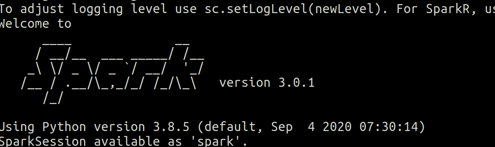

# 2. Primera ejecución del contador
Hemos tenido que cambiar la ruta de los datos. En el archivo original aparecía así :
~~~ python
lines = sc.textFile("file:///SparkCourse/ml-100k/u.data")
~~~
Y nosotros hemos tenido que ponerlo así:
~~~ python
lines = sc.textFile("./ml-100k/u.data")
~~~
Simplemente porque nuestra ruta hacia los datos es distinta.

~~~ python
(spark-course) ➜  ~ spark-submit ratings.counter.py
~~~

# 3. Key / Value RDD'S

Vamos analizar la media de amigos por edad y para eso tenemos que ejecutar el archivo friends-by-age.py

1º cargamos el archivo fakefriend.csv
~~~ python
lines = sc.textFile("./data/fakefriends.csv")
~~~

2º Creamos RDD pero haciendo un map a los datos con la función parseline

~~~ python

rdd = lines.map(parseLine)

def parseLine(line):
    fields = line.split(',')
    age = int(fields[2])
    numFriends = int(fields[3])
    return (age, numFriends)
~~~ 
3º Creamos una variable con los totales por la edad `totalsByAge`, para ello usamos las acciones mapValues(func) y reduceByKey(func)

*mapValues(func)* crea un nuevo RDD de pares clave/valor, resultado de aplicar únicamente sobre los valores la función func, que recibe un solo parámetro.
*reduceByKey(func)* devuelve un RDD de pares clave/valor, donde cada clave única se corresponde con las diferentes claves del RDD original, y el valor es el resultado de aplicar una operación reduce sobre los valores correspondientes a una misma clave.

~~~ python
totalsByAge = rdd.mapValues(lambda x: (x, 1)).reduceByKey(lambda x, y: (x[0] + y[0], x[1] + y[1]))
~~~
4º Obtenemos las medias de las edades.

~~~python
averagesByAge = totalsByAge.mapValues(lambda x: round(x[0] / x[1],2))
results = averagesByAge.collect()
for result in results:
    print(result)
~~~

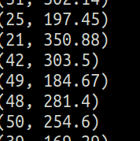

# 4.Filtering RDD'S
Vamos a obtener la temperatura mínima obsevada por cada estación metereológica.

1º cargamos el archivo fakefriend.csv
~~~ python
lines = sc.textFile("./data/1800.csv")
~~~

2º Creamos RDD pero haciendo un map a los datos con la función parseline

~~~ python

rdd = lines.map(parseLine)

def parseLine(line):
    fields = line.split(',')
    stationID = fields[0]
    entryType = fields[2]
    temperature = float(fields[3]) * 0.1 * (9.0 / 5.0) + 32.0
    return (stationID, entryType, temperature)

~~~ 

3º Creamos una variable`minTemps` dondes solo vamos a guardar los valores que estén filtrados por el valor  `TMIN`
~~~ python
minTemps = parsedLines.filter(lambda x: "TMIN" in x[1])
~~~
*filter(func)* retorna un nuevo RDD que solo contiene los elementos del RDD original que satisfacen el predicado especificado en la función func (que retornará True o False)

4º Obtenemos `stationTemps` que cogemos sólo los valores de la posición 0 y 2 del la varible `minTemps` y reducimos los valores por lo que tengan el valor mínimo y por último imprimimos los resultados

~~~ python
stationTemps = minTemps.map(lambda x: (x[0], x[2]))
minTemps = stationTemps.reduceByKey(lambda x, y: min(x,y))
results = minTemps.collect()

for result in results:
    print(result[0] + "\t{:.2f}F".format(result[1]))
~~~

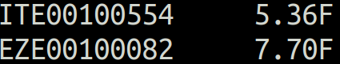

Como ejericio hemos creado obtenido el valor máximo.

Sólo hemos cambiado estas líneas
~~~ python
maxTemps = parsedLines.filter(lambda x: "TMAX" in x[1])

stationTemps = maxTemps.map(lambda x: (x[0], x[2]))
maxTemps = stationTemps.reduceByKey(lambda x, y: max(x,y))
results = maxTemps.collect()

~~~
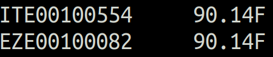

# 5. map VS. flatmap

Vamos a ver las diferencias entre map y flatmap

`map(func)` retorna un nuevo RDD, resultado de pasar cada uno de los elementos del RDD original como parámetro de la función func.

`flatMap(func)` es similar a map(func) pero en caso de que func retorne una lista o tupla, esta no será mapeada directamente en el RDD resultante, sino que se mapearán individualmente los elementos contenidos.

Ahora vamos a contar cuantas palabras hay en un texto y cuantas veces se repite esa palabra.

1º cargamos el archivo fakefriend.csv
~~~ python
input = sc.textFile("./data/book.txt")
~~~

2º aplicamos a `input` la función flatmap para obtener en un array cada palabra por separdo y contamos las veces que esa palabra aparece con `countByValue()`

~~~ python
words = input.flatMap(lambda x: x.split())
wordCounts = words.countByValue()
~~~

3º imprimimos el resultado
~~~ python
for word, count in wordCounts.items():
    cleanWord = word.encode('ascii', 'ignore')
    if (cleanWord):
        print(cleanWord.decode() + " " + str(count))
~~~
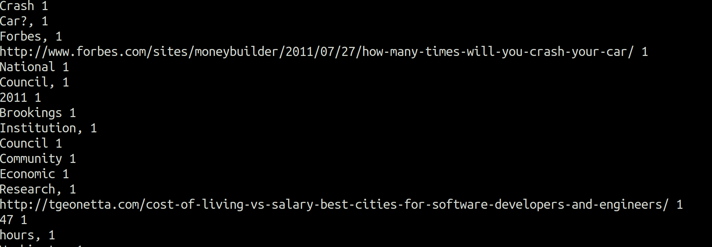

# 6. Text normalization with Regex  and sorted

1º Importamos librería de expresiones regulares
~~~ python
import re
~~~
2º Creamos función en la que busca todas las palabras que se ajustan a la expresión regular y las pone en minúscula 
~~~python
def normalizeWords(text):
    return re.compile(r'\W+', re.UNICODE).split(text.lower())

input = sc.textFile("./data/book.txt")
words = input.flatMap(normalizeWords)
wordCounts = words.countByValue()

~~~
3º Imprimos el resultado
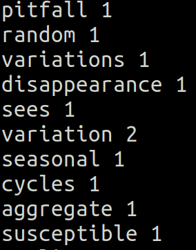

4º Ordenamos por mayor número. 

~~~ python
wordCounts = words.map(lambda x: (x, 1)).reduceByKey(lambda x, y: x + y)
wordCountsSorted = wordCounts.map(lambda x: (x[1], x[0])).sortByKey()
results = wordCountsSorted.collect()

~~~
5º Imprimos el resultado
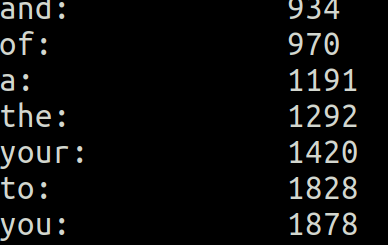

# 7. Total spent by customer
1º importamos las librerias de pyspark y creamos la conf

~~~ python
from pyspark import SparkConf, SparkContext

conf = SparkConf().setMaster("local").setAppName("SpendByCustomer")
sc = SparkContext(conf = conf)
~~~

2º Creamos la función que va a separar los valores por las comas
~~~ python
def extractCustomerPricePairs(line):
    fields = line.split(',')
    return (int(fields[0]), float(fields[2]))
~~~

3º Cargamos el archivo `customer-order.csv`
~~~python
input = sc.textFile("./data/customer-orders.csv")
~~~
4º Hacemos el mapeo del archivo `input` con la función `extractCustomerPricePairs` y creamos `totalByCustomer`con la función `reduceBykey`.

~~~python
mappedInput = input.map(extractCustomerPricePairs)
totalByCustomer = mappedInput.reduceByKey(lambda x, y: x + y)
~~~
5º Obtenemos los resultados y los imprimos.
~~~ python
results = totalByCustomer.collect()
for result in results:
    print(result)
~~~
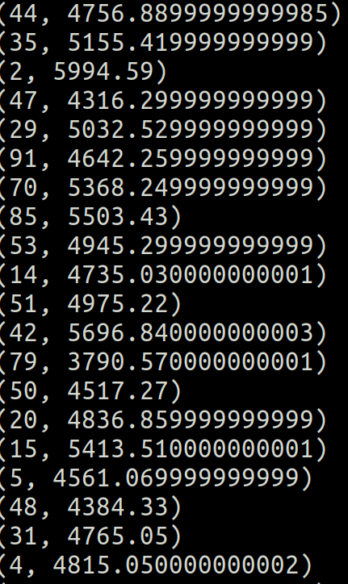

# 8. Introducción a spark-SQL
*   DataFrames and Datasets
    - Contiene fila de objetos
    - Puede hacer queries a SQL
    - Puedes tener esquemas
    - Lee y escribe en JSON, ..
    - Comunición JDBC/ ODBC, Tableau

1º Importamos las librerías para poder trabajar con los DataFrame
~~~ python
from pyspark.sql import SparkSession
from pyspark.sql import Row
~~~

2º Creamos una session SparkSession
~~~ Python
spark = SparkSession.builder.appName("SparkSQL").getOrCreate()
~~~
3º Definimos una función que va a convertir los datos en filas
~~~ python
def mapper(line):
    fields = line.split(',')
    return Row(ID=int(fields[0]), name=str(fields[1].encode("utf-8")), age=int(fields[2]), numFriends=int(fields[3]))
~~~
4º Cargamos lo datos, creamos RDD y las mapeamos con la función.
~~~ python

lines = spark.sparkContext.textFile("./data/fakefriends.csv")
people = lines.map(mapper)
~~~

5º Definimos  el esquema y registre el DataFrame como una tabla.
~~~python
schemaPeople = spark.createDataFrame(people).cache()
schemaPeople.createOrReplaceTempView("people")
~~~
6º Hacemos las queries e imprimimos los resultados
~~~ python
teenagers = spark.sql("SELECT * FROM people WHERE age >= 13 AND age <= 19")

for teen in teenagers.collect():
  print(teen)
~~~
7º También podemos hacer instacias de SQL queries
~~~ python
 schemaPeople.groupBy("age").count().orderBy("age").show()
~~~

8º Cerramos sesión
~~~ python 
spark.stop()
~~~

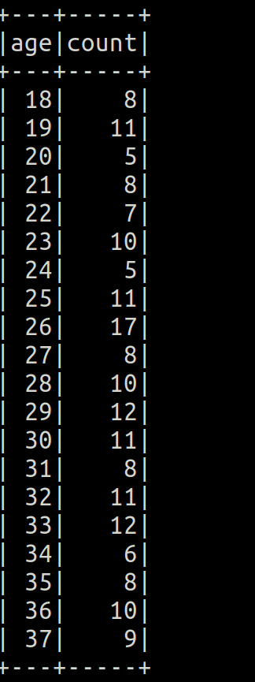

9º Ejercicio media de amigos por edad.
~~~ python
# Select only age and numFriends columns
friendsByAge = people.select("age", "friends")

# From friendsByAge we group by "age" and then compute average
friendsByAge.groupBy("age").avg("friends").show()

#Sorted 
friendsByAge.groupBy("age").avg("friends").sort("age").show()

# With a custom column name
friendsByAge.groupBy("age").agg(func.round(func.avg("friends"), 2)
  .alias("friends_avg")).sort("age").show()

~~~

# 9. Usando las funciones de SQL.
Se usan para dataframes.

* func.explode => Muy parecida a flatmap
* func.split => Parecida a split
* func.lower => Parecida a lower

1º Importamos las librerías
~~~ python
from pyspark.sql import SparkSession
from pyspark.sql import functions as func
~~~
2º Creamos la conexión y cargamos los datos
~~~python
spark = SparkSession.builder.appName("WordCount").getOrCreate()

# Read each line of my book into a dataframe
inputDF = spark.read.text("./data/book.txt")
~~~
3º Dividimos usando una expresión regular que extrae palabras

~~~ python
words = inputDF.select(func.explode(func.split(inputDF.value, "\\W+")).alias("word"))
words.filter(words.word != "")
~~~
4º Las ponemos todas en minsúculas
~~~ python
lowercaseWords = words.select(func.lower(words.word).alias("word"))
~~~
5º Contamos cuantas aparaciones de cada palabra, las ordenamos e imprimimos por pantalla
~~~ python
wordCounts = lowercaseWords.groupBy("word").count()
wordCountsSorted = wordCounts.sort("count")
wordCountsSorted.show(wordCountsSorted.count())
~~~
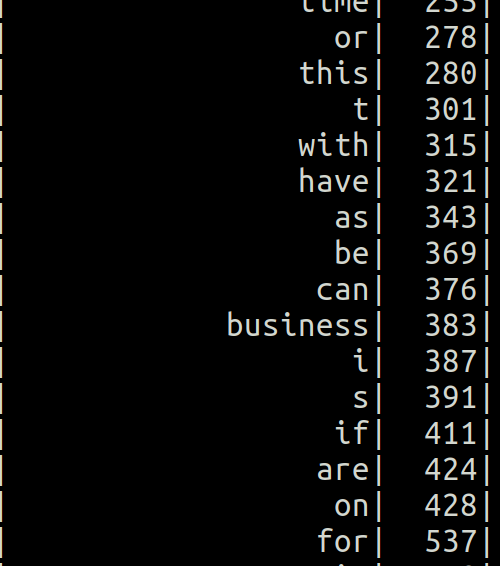

# 10. SprakSession.read y withColumn()
1º Importamos liberías y creamos la conexión.

~~~python
from pyspark.sql import SparkSession
from pyspark.sql import functions as func
from pyspark.sql.types import StructType, StructField, StringType, IntegerType, FloatType

spark = SparkSession.builder.appName("MinTemperatures").getOrCreate()
~~~
2º Creamos el esquema que le vamos a dar  al dataframe
~~~python
schema = StructType([ \
                     StructField("stationID", StringType(), True), \
                     StructField("date", IntegerType(), True), \
                     StructField("measure_type", StringType(), True), \
                     StructField("temperature", FloatType(), True)])
~~~
3º Aplicamos a los datos leído el esquema que creamos anteriomente
~~~python

df = spark.read.schema(schema).csv("./data/1800.csv")
df.printSchema()
~~~
4º Filtramos por `TMIN` y seleccionamos solo las columnas `stationID`y `temperature`
~~~python

minTemps = df.filter(df.measure_type == "TMIN")

stationTemps = minTemps.select("stationID", "temperature")
~~~
5º Hacemos un agrupamiento por `stationID`y obtenemos la temperatura mínima
~~~Python

minTempsByStation = stationTemps.groupBy("stationID").min("temperature")
minTempsByStation.show()
~~~
6º Comvertimos la temperatura a fahrenheit y las ordenamos
~~~python
# Convert temperature to fahrenheit and sort the dataset
minTempsByStationF = minTempsByStation.withColumn("temperature",
                                                  func.round(func.col("min(temperature)") * 0.1 * (9.0 / 5.0) + 32.0, 2))\
                                                  .select("stationID", "temperature").sort("temperature")
~~~
7º Imprimimos los resultado y cerramos la conexión
~~~Python                                                  
# Collect, format, and print the results
results = minTempsByStationF.collect()

for result in results:
    print(result[0] + "\t{:.2f}F".format(result[1]))
    
spark.stop()

~~~

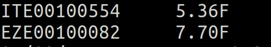

# 11. Broadcast varialbes
`popular-movies-nice-dataframe.py`
Las variables difundidas (conocidas en la terminología inglesa como broadcast variables) permiten guardar una variable de solo lectura en cada máquina, sin necesidad de enviar una copia de esta cada vez que se envíe una tarea al nodo. 

Cuando se definen múltiples transformaciones y operaciones, Spark automáticamente dispersa los datos necesarios por las tareas en cada etapa. Difundir explícitamente variables solo es útil cuando las tareas, en sus múltiples etapas, necesitan siempre los mismos datos.

Para difundir una variable se debe usar el método broadcast(var) de la clase SparkContext.
1º Cargamos las librerías  importamos codecs, porque vamos a usar u.ITEM
~~~ python
from pyspark.sql import SparkSession
from pyspark.sql import functions as func
from pyspark.sql.types import StructType, StructField, IntegerType, LongType
import codecs 
~~~
2º Creamos la función `loadMoviesNames`, que genera un diccionario con el nombre de la película y el ID
~~~python
def loadMovieNames():
    movieNames = {}
    # CHANGE THIS TO THE PATH TO YOUR u.ITEM FILE:
    with codecs.open("./data/ml-100k/u.ITEM", "r", encoding='ISO-8859-1', errors='ignore') as f:
        for line in f:
            fields = line.split('|')
            movieNames[int(fields[0])] = fields[1]
  
     return movieNames
~~~
3º Creamos la sesión
~~~ python
spark = SparkSession.builder.appName("PopularMovies").getOrCreate()
spark.sparkContext.setLogLevel("ERROR")
~~~
4º  Creamos la variable broadcast
~~~python
nameDict = spark.sparkContext.broadcast(loadMovieNames())
~~~
5º Creamos el esquema para leer el achivo u.data, cargamos el archivo como dataframe y creamos la varibale `movieCounts` que agrupa por `movieId`y las cuenta
~~~python
schema = StructType([ \
                     StructField("userID", IntegerType(), True), \
                     StructField("movieID", IntegerType(), True), \
                     StructField("rating", IntegerType(), True), \
                     StructField("timestamp", LongType(), True)])

moviesDF = spark.read.option("sep", "\t").schema(schema).csv("./data/ml-100k/u.data")

movieCounts = moviesDF.groupBy("movieID").count()
~~~
6º Creamos una función `user-defined` o `UDF`  busca los nombre de la peliculas en el broadcast diccionario
~~~python

def lookupName(movieID):
    return nameDict.value[movieID]

lookupNameUDF = func.udf(lookupName)
~~~
7º Añadimos la columna título al udf, ordenamos y mostramos los 10 primeros
~~~python
moviesWithNames = movieCounts.withColumn("movieTitle", lookupNameUDF(func.col("movieID")))

# Sort the results
sortedMoviesWithNames = moviesWithNames.orderBy(func.desc("count"))

# Grab the top 10
sortedMoviesWithNames.show(10, False)

# Stop the session
spark.stop()
~~~
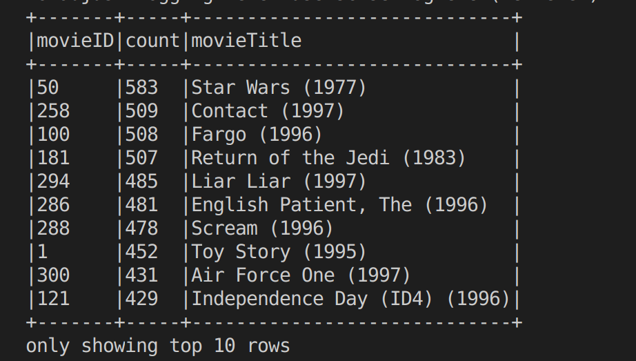

# 12. Most popular superhero

`most-popular-superhero-dataframe.py`

1º Importamos librerías, creamos sesión y hacemos el esquema del dataframe
~~~Python
schema = StructType([ \
                     StructField("id", IntegerType(), True), \
                     StructField("name", StringType(), True)])
~~~
2º Cargamos los archivos `Marvel-Names.txt`y `Marvel-Graph.txt`
~~~python
names = spark.read.schema(schema).option("sep", " ").csv("./data/Marvel-Names.txt")

lines = spark.read.text("./data/Marvel-Graph.txt")
~~~
3º Creamos `connections`, le añadimos dos columnas la `id` y `connections`. Lo agrupamos por `id` y sumamos las `connectiones`
~~~Python

connections = lines.withColumn("id", func.split(func.trim(func.col("value")), " ")[0]) \
    .withColumn("connections", func.size(func.split(func.trim(func.col("value")), " ")) - 1) \
    .groupBy("id").agg(func.sum("connections").alias("connections"))
~~~
4º Obtenemos los mas ppopulares y los ordenamos.
~~~python    
mostPopular = connections.sort(func.col("connections").desc()).first()

mostPopularName = names.filter(func.col("id") == mostPopular[0]).select("name").first()
~~~
5º Imprimimos el mas popular.
~~~ python
print(mostPopularName[0] + " is the most popular superhero with " + str(mostPopular[1]) + " co-appearances.")
~~~

`CAPTAIN AMERICA is the most popular superhero with 1933 co-appearances.`

# 13. Introducing Breadth-First-Search
1º Nuestro acumulador, utilizado para señalar cuando encontramos el personaje objetivo durante nuestro recorrido BFS.
~~~python
   hitCounter = sc.accumulator(0)
~~~
2º Función que imita el BFS
~~~python
def convertToBFS(line):
    fields = line.split()
    heroID = int(fields[0])
    connections = []
    for connection in fields[1:]:
        connections.append(int(connection))

    color = 'WHITE'
    distance = 9999

    if (heroID == startCharacterID):
        color = 'GRAY'
        distance = 0

    return (heroID, (connections, distance, color))
~~~
3º Crea `RDD` y lo mapea con la funcion `convertToBFS`
~~~python

def createStartingRdd():
    inputFile = sc.textFile("./data/Marvel-Graph.txt")
    return inputFile.map(convertToBFS)
~~~
4º Calcula los grados
~~~python
def bfsMap(node):
    characterID = node[0]
    data = node[1]
    connections = data[0]
    distance = data[1]
    color = data[2]

    results = []
    if (color == 'GRAY'):
        for connection in connections:
            newCharacterID = connection
            newDistance = distance + 1
            newColor = 'GRAY'
            if (targetCharacterID == connection):
                hitCounter.add(1)

            newEntry = (newCharacterID, ([], newDistance, newColor))
            results.append(newEntry)

        color = 'BLACK'

    results.append( (characterID, (connections, distance, color)) )
    return results
~~~
5º Función `bfsReduce`
~~~python
def bfsReduce(data1, data2):
    edges1 = data1[0]
    edges2 = data2[0]
    distance1 = data1[1]
    distance2 = data2[1]
    color1 = data1[2]
    color2 = data2[2]

    distance = 9999
    color = color1
    edges = []

    # See if one is the original node with its connections.
    # If so preserve them.
    if (len(edges1) > 0):
        edges.extend(edges1)
    if (len(edges2) > 0):
        edges.extend(edges2)

    # Preserve minimum distance
    if (distance1 < distance):
        distance = distance1

    if (distance2 < distance):
        distance = distance2

    # Preserve darkest color
    if (color1 == 'WHITE' and (color2 == 'GRAY' or color2 == 'BLACK')):
        color = color2

    if (color1 == 'GRAY' and color2 == 'BLACK'):
        color = color2

    if (color2 == 'WHITE' and (color1 == 'GRAY' or color1 == 'BLACK')):
        color = color1

    if (color2 == 'GRAY' and color1 == 'BLACK'):
        color = color1

    return (edges, distance, color)
~~~
 6º El progama principal
~~~python

iterationRdd = createStartingRdd()

for iteration in range(0, 10):
    print("Running BFS iteration# " + str(iteration+1))

    # Create new vertices as needed to darken or reduce distances in the
    # reduce stage. If we encounter the node we're looking for as a GRAY
    # node, increment our accumulator to signal that we're done.
    mapped = iterationRdd.flatMap(bfsMap)

    # Note that mapped.count() action here forces the RDD to be evaluated, and
    # that's the only reason our accumulator is actually updated.
    print("Processing " + str(mapped.count()) + " values.")

    if (hitCounter.value > 0):
        print("Hit the target character! From " + str(hitCounter.value) \
            + " different direction(s).")
        break

    # Reducer combines data for each character ID, preserving the darkest
    # color and shortest path.
    iterationRdd = mapped.reduceByKey(bfsReduce)
~~~ 

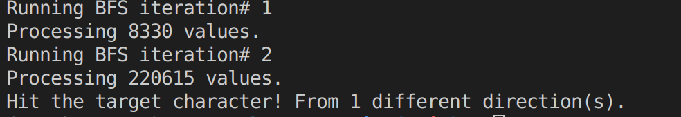

# 14. Item-Based Collaborative Filtering in Spark, cache(), and persist()
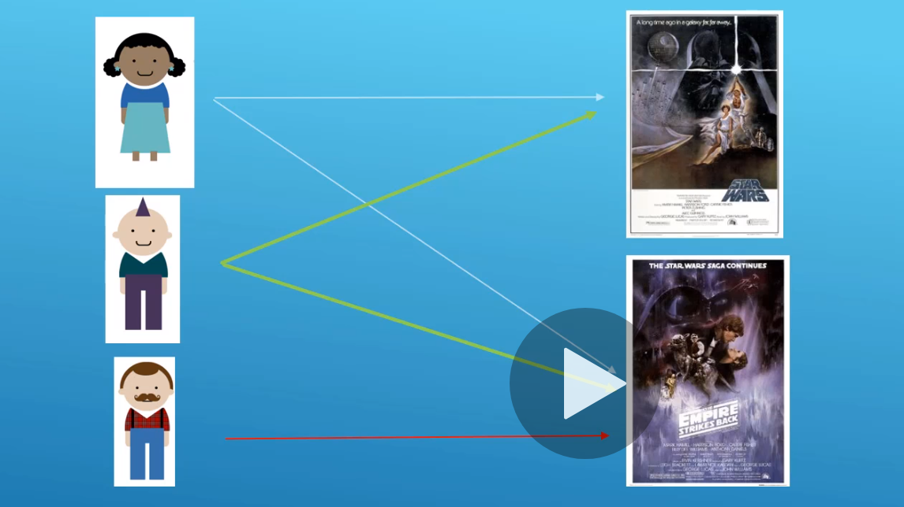

En un RDD de gran tamaño, recalcular dos veces una misma transformación conllevará un sobrecoste nada despreciable en términos de tiempo de ejecución. Para evitarlo, Spark provee dos métodos, `persist()` y `cache()`, para guardar transformaciones intermedias y poder reutilizarlas, evitando repetir varias veces un mismo grupo de cálculos. La diferencia entre ambos es que `cache()` guarda los RDD en el nivel de almacenamiento por defecto (como objetos de Java serializados en la memoria principal) y `persist([nivel])` permite, mediante un parámetro opcional, elegir un nivel de almacenamiento de entre las siguientes constantes.

0 Para ejecutar este programa, 50 es el id de la película.
~~~python
spark-submit movie-similarities-dataframe.py 50
~~~
1º Importamos sys para poder coger el argumento que no entra por parámetros en la ejecución
~~~python
import sys
~~~ 
2º Creamos el cosinesimilarity con los ratings
~~~python
def computeCosineSimilarity(spark, data):
    # Compute xx, xy and yy columns
    pairScores = data \
      .withColumn("xx", func.col("rating1") * func.col("rating1")) \
      .withColumn("yy", func.col("rating2") * func.col("rating2")) \
      .withColumn("xy", func.col("rating1") * func.col("rating2")) 

    # Compute numerator, denominator and numPairs columns
    calculateSimilarity = pairScores \
      .groupBy("movie1", "movie2") \
      .agg( \
        func.sum(func.col("xy")).alias("numerator"), \
        (func.sqrt(func.sum(func.col("xx"))) * func.sqrt(func.sum(func.col("yy")))).alias("denominator"), \
        func.count(func.col("xy")).alias("numPairs")
      )

    # Calculate score and select only needed columns (movie1, movie2, score, numPairs)
    result = calculateSimilarity \
      .withColumn("score", \
        func.when(func.col("denominator") != 0, func.col("numerator") / func.col("denominator")) \
          .otherwise(0) \
      ).select("movie1", "movie2", "score", "numPairs")

    return result
~~~
3º Obtenemos el nombre de la peli por el movie id
~~~ python
# Get movie name by given movie id 
def getMovieName(movieNames, movieId):
    result = movieNames.filter(func.col("movieID") == movieId) \
        .select("movieTitle").collect()[0]

    return result[0]
~~~
4º Creamos sesión, los esquemas para los datos y leemos los datos. 
~~~python

spark = SparkSession.builder.appName("MovieSimilarities").master("local[*]").getOrCreate()
spark.sparkContext.setLogLevel("ERROR")
movieNamesSchema = StructType([ \
                               StructField("movieID", IntegerType(), True), \
                               StructField("movieTitle", StringType(), True) \
                               ])
    
moviesSchema = StructType([ \
                     StructField("userID", IntegerType(), True), \
                     StructField("movieID", IntegerType(), True), \
                     StructField("rating", IntegerType(), True), \
                     StructField("timestamp", LongType(), True)])
    
    
# Create a broadcast dataset of movieID and movieTitle.
# Apply ISO-885901 charset
movieNames = spark.read \
      .option("sep", "|") \
      .option("charset", "ISO-8859-1") \
      .schema(movieNamesSchema) \
      .csv("./data/ml-100k/u.item")

# Load up movie data as dataset
movies = spark.read \
      .option("sep", "\t") \
      .schema(moviesSchema) \
      .csv("./data/ml-100k/u.data")
~~~
5º Creamos ratings con los valores de `"userId", "movieId", "rating"`
~~~python

ratings = movies.select("userId", "movieId", "rating")
~~~
6º  Obtenemos todas las películas clasificadas juntas por el mismo usuario. Hacemos un `join` para encontrar todas las combinaciones.  Selecionamos pares de películas y pares de calificación
~~~python

moviePairs = ratings.alias("ratings1") \
      .join(ratings.alias("ratings2"), (func.col("ratings1.userId") == func.col("ratings2.userId")) \
            & (func.col("ratings1.movieId") < func.col("ratings2.movieId"))) \
      .select(func.col("ratings1.movieId").alias("movie1"), \
        func.col("ratings2.movieId").alias("movie2"), \
        func.col("ratings1.rating").alias("rating1"), \
        func.col("ratings2.rating").alias("rating2"))

moviePairSimilarities = computeCosineSimilarity(spark, moviePairs).cache()
~~~
7º Programa pincipal
~~~python
if (len(sys.argv) > 1):
    
    scoreThreshold = 0.97
    coOccurrenceThreshold = 50.0

    movieID = int(sys.argv[1])

    # Filter for movies with this sim that are "good" as defined by
    # our quality thresholds above
    filteredResults = moviePairSimilarities.filter( \
        ((func.col("movie1") == movieID) | (func.col("movie2") == movieID)) & \
          (func.col("score") > scoreThreshold) & (func.col("numPairs") > coOccurrenceThreshold))

    # Sort by quality score.
    results = filteredResults.sort(func.col("score").desc()).take(10)
    
    print ("Top 10 similar movies for " + getMovieName(movieNames, movieID))
    
    for result in results:
        # Display the similarity result that isn't the movie we're looking at
        similarMovieID = result.movie1
        if (similarMovieID == movieID):
          similarMovieID = result.movie2
        
        print(getMovieName(movieNames, similarMovieID) + "\tscore: " \
              + str(result.score) + "\tstrength: " + str(result.numPairs))
else:
  print("Need argument")
~~~
        
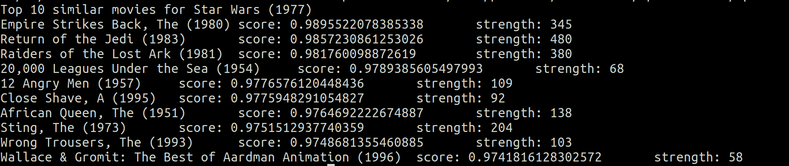

# 15. Introducing Spark.ML

ALS (Alternating Least Squares).

1º Importamos todas la librerías y además esta nueva
~~~python
from pyspark.ml.recommendation import ALS
~~~
2º Creamos función para cargar los datos, y la sesion de spark

~~~python
def loadMovieNames():
    movieNames = {}
    # CHANGE THIS TO THE PATH TO YOUR u.ITEM FILE:
    with codecs.open("./data/ml-100k/u.item", "r", encoding='ISO-8859-1', errors='ignore') as f:
        for line in f:
            fields = line.split('|')
            movieNames[int(fields[0])] = fields[1]
    return movieNames

spark = SparkSession.builder.appName("ALSExample").getOrCreate()
~~~
3º Creamos el esquema para los datos para `ratings`, leemos los datos y le hacemos el esquema
~~~python
    
moviesSchema = StructType([ \
                     StructField("userID", IntegerType(), True), \
                     StructField("movieID", IntegerType(), True), \
                     StructField("rating", IntegerType(), True), \
                     StructField("timestamp", LongType(), True)])
    
names = loadMovieNames()
    
ratings = spark.read.option("sep", "\t").schema(moviesSchema) \
    .csv("./data/ml-100k/u.data")
~~~
4º Entrenamos el recomendador
~~~python    
print("Training recommendation model...")

als = ALS().setMaxIter(5).setRegParam(0.01).setUserCol("userID").setItemCol("movieID") \
    .setRatingCol("rating")
    
model = als.fit(ratings)
~~~
5º Construimos el dataframe con el `userID`
~~~python
# Manually construct a dataframe of the user ID's we want recs for
userID = int(sys.argv[1])
userSchema = StructType([StructField("userID", IntegerType(), True)])
users = spark.createDataFrame([[userID,]], userSchema)
~~~
6º Creamos las recomendaciones  `recommendations` e imprimimos los resultados
~~~python
recommendations = model.recommendForUserSubset(users, 10).collect()

print("Top 10 recommendations for user ID " + str(userID))

for userRecs in recommendations:
    myRecs = userRecs[1]  #userRecs is (userID, [Row(movieId, rating), Row(movieID, rating)...])
    for rec in myRecs: #my Recs is just the column of recs for the user
        movie = rec[0] #For each rec in the list, extract the movie ID and rating
        rating = rec[1]
        movieName = names[movie]
        print(movieName + str(rating))
        
~~~

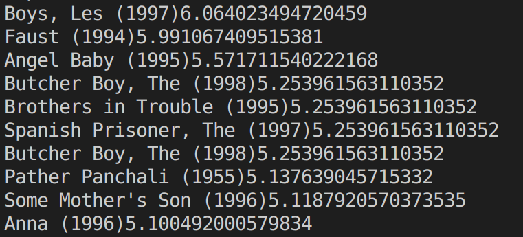

# Enlaces que hemos usado
[Digitalbooks](http://reader.digitalbooks.pro/content/preview/books/41061/book/OEBPS/Text/capitulo_3.html)

[Spark doc](http://spark.apache.org/docs/latest/api/python/pyspark.html?highlight=mapvalues)

[Datacamp](https://www.datacamp.com/community/blog/pyspark-cheat-sheet-python)

[Breadth-First-Search](https://en.wikipedia.org/wiki/Breadth-first_search)